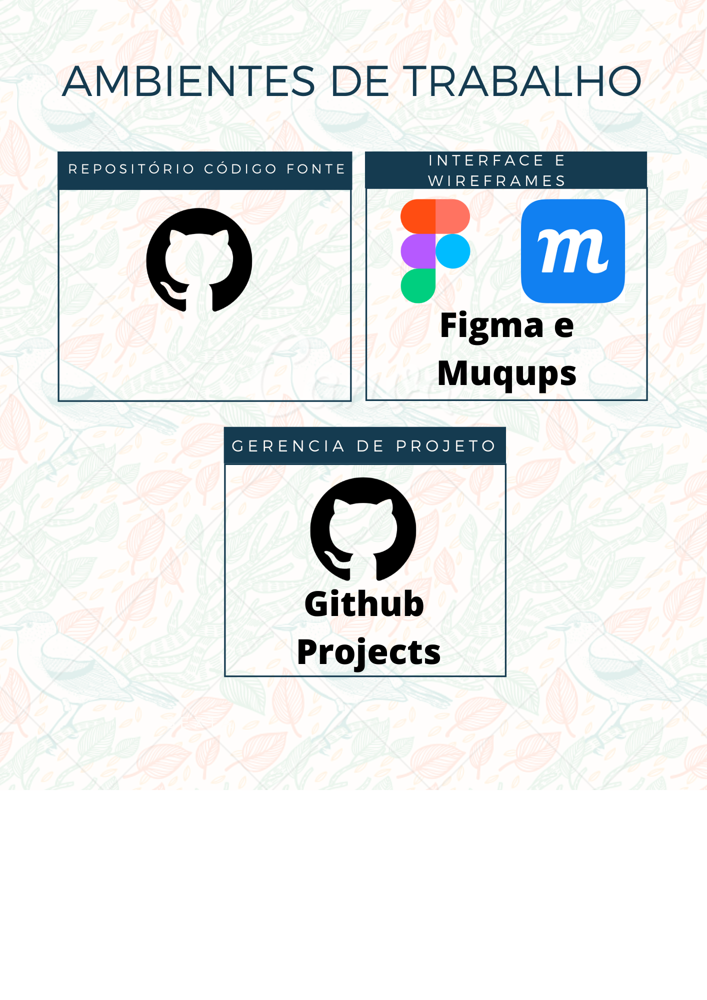

# Metodologia

Pré-requisitos: <a href="2-Especificação do Projeto.md"> Documentação de Especificação</a>

A metodologia a ser utilizada é do SCRUM onde toda entrega é com transparência, uma inspeção constante de tudo que está sendo feito aos poucos. Ambiente de trabalho é de reuniões realizada pela equipe via Teams para esclarecimento de dúvidas, sugestões para o projeto e apresentações dos artefatos. Sendo todo o código fonte trabalhado no repositório Github, desde a criação de sprints até as próprias representações do projeto, usando como base toda as prioridades dos requisitos citados na Especificação do Projeto. Ambientes de trabalho em geral serão descritos abaixo:

## Ambientes de trabalho:
Os ambientes de trabalho utilizados e onde serão produzidos os artefatos do projeto serão conforme indica a imagem abaixo:

### Segue os links de cada ambiente informado:
- [Repositório GitHub](https://github.com/ICEI-PUC-Minas-PMV-ADS/pmv-ads-2022-1-e1-proj-web-t2-vechile-protection)
- Interface e Wireframes: [Moqups](https://app.moqups.com/fINfnxbExoGxMFqV1S40dykbsNIbcYYH/view/page/afcf69248?ui=0) & [Figma](https://www.figma.com/file/AcWfTVOZBj3Bm0ECVKk9TM/Vechile-protection?node-id=0%3A1)
- Projects: [Projects](https://github.com/ICEI-PUC-Minas-PMV-ADS/pmv-ads-2022-1-e1-proj-web-t2-vechile-protection/projects/2)

## Gerenciamento de Projeto
Utilizando metodologias ágeis conforme o scrum, a equipe de projeto ficou dividida em:
#### Scrum Master: 
- Anderson do Carmo
#### Product Owner: 
- Vinicius Ottoni
#### Equipe de desenvolvimento:
- Leandro Furtado
#### Equipe de Design:
- Victor Marcos

### Divisão de Papéis

Apresente a divisão de papéis entre os membros do grupo.

> **Links Úteis**:
> - [11 Passos Essenciais para Implantar Scrum no seu 
> Projeto](https://mindmaster.com.br/scrum-11-passos/)
> - [Scrum em 9 minutos](https://www.youtube.com/watch?v=XfvQWnRgxG0)

### Processo

Coloque  informações sobre detalhes da implementação do Scrum seguido pelo grupo. O grupo poderá fazer uso de ferramentas on-line para acompanhar o andamento do projeto, a execução das tarefas e o status de desenvolvimento da solução.
 
> **Links Úteis**:
> - [Project management, made simple](https://github.com/features/project-management/)
> - [Sobre quadros de projeto](https://docs.github.com/pt/github/managing-your-work-on-github/about-project-boards)
> - [Como criar Backlogs no Github](https://www.youtube.com/watch?v=RXEy6CFu9Hk)
> - [Tutorial Slack](https://slack.com/intl/en-br/)

### Ferramentas

As ferramentas empregadas no projeto são:

- Editor de código.
- Ferramentas de comunicação
- Ferramentas de desenho de tela (_wireframing_)

O editor de código foi escolhido porque ele possui uma integração com o
sistema de versão. As ferramentas de comunicação utilizadas possuem
integração semelhante e por isso foram selecionadas. Por fim, para criar
diagramas utilizamos essa ferramenta por melhor captar as
necessidades da nossa solução.

Liste quais ferramentas foram empregadas no desenvolvimento do projeto, justificando a escolha delas, sempre que possível.
 
> **Possíveis Ferramentas que auxiliarão no gerenciamento**: 
> - [Slack](https://slack.com/)
> - [Github](https://github.com/)
